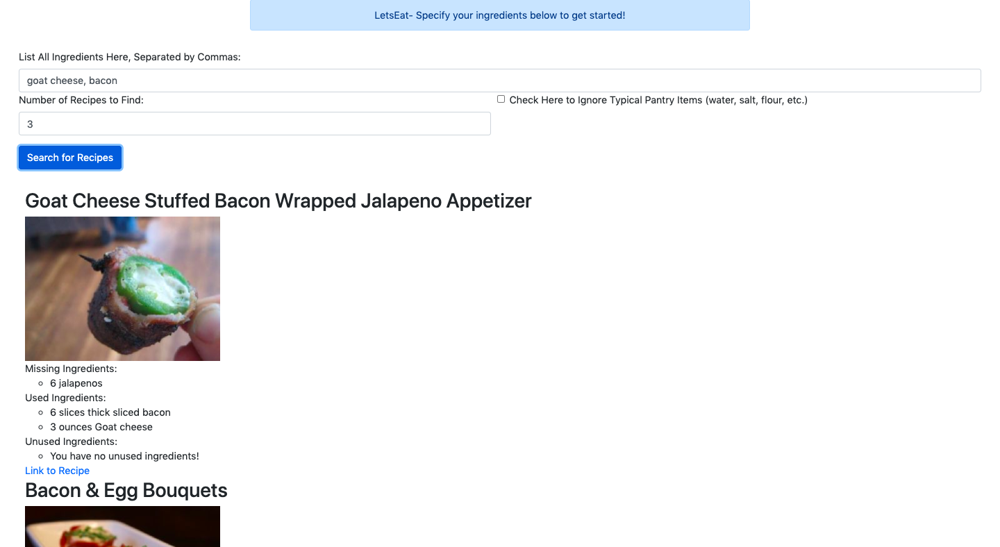

# Let's Eat
In quarantine, I often found myself wanting to cook something and having a bunch of random ingredients, but I didn't know what to make.
This inspired me to create Let's Eat, a website that allows you to enter the ingreidents you have, and it'll return recipes you can make with those ingredients! 
 
To run the website, clone the repository and through your command line, change the working directory to this project. Then, type "python3 manage.py runserver" into the command line. You'll see something like: "Starting development server at http://127.0.0.1:8000/". Copy and paste the http:// link into your web browser, and start cooking!
 
Note: The API key used in this code will only allow for 70 recipes to be searched for per day, so please be mindful of that :).
 
Here are some examples of the website in action:

